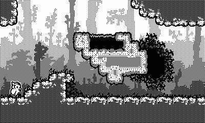

# Owlet's Embrace (working title)
The goal is to make a 2D metroidvania from scratch using almost no external libraries for the **Playdate** in C. I only upload the source code and keep stuff like lib files and assets local. The game has two backends: One on top of the PlaydateSDK, and another one on top of SDL.

### Concept

The game will be about the feeling I had as a kid when going outside and imagining all kinds of crazy stuff. Exploring local forests, finding cool spots, collecting things, thinking about fighting evil with a stick, occasionally getting into trouble. It's also about questioning and finding confidence in yourself. The story and game mechanics of the game will tie into those themes. A small owl accidentally falling out of the nest and landing in the land of nowhere, being lost. It starts exploring the world on its own after a while, having fun, getting some scratches every now and then, getting back up and starting to embrace its strengths, capabilities and personality while growing up - but there are still loose ends to tie back together. I want to play with contrasts, "black & white" so to speak: Contrast lighthearted sections with dark themes, alternate between different moods etc: On one hand there are places to calm down and where you like to spend time in, having fun. On the other hand there are grim dungeons and dangerous places, filled with all kinds of unknown stuff, creatures and mysteries. I really like that back and forth.

I'll do my best to convey those themes, and being a Metroidvania fan this is the genre I chose. Exploring, finding your way, getting stronger.

### Why Playdate
I've been on that game concept for a while now and wasn't able to make any notable progress mostly because of the unconstrained "blank page" problem: What resolution, should I go 2D/3D, what colors, how much performance, gamepad or keyboard, what graphics API, etc. I really tried to self-impose constraints like "make a game according to PICO-8 specs", but I can break those constraints just as easy as I created them so they're worth nothing to me. Hard-constraints by going for a single hardware device solves that problem and strips away those decisions from me.

I'm a stereotypical low-level-everything-from-scratch-C-programmer. I like retro gaming. Embedded platforms fascinate me. Enter the Playdate which combines everything into one. It puts hard constraints into place: Monochrome, fixed resolution, a small known CPU and limited Ram, a dpad, some buttons and a crank. And it's a modern handheld still in production, which makes a difference compared to an ancient device like the Game Boy.
