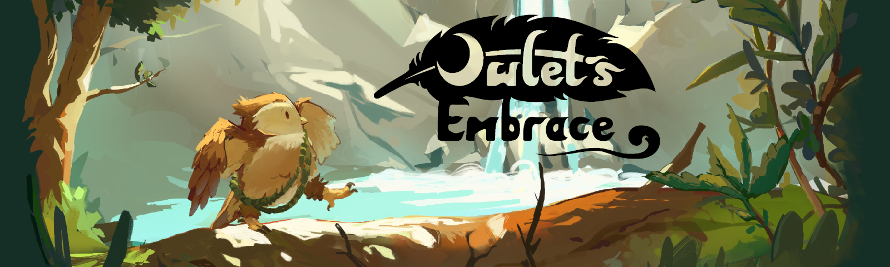
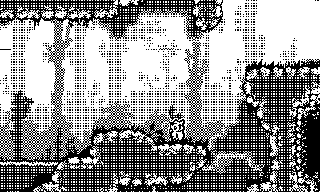
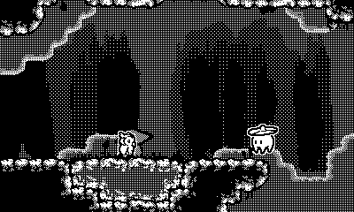

# Owlet's Embrace

An owlet afraid of flight sets off to explore a vibrant mysterious world and rediscover itself. On this heartwarming adventure, you'll confront the owlet's deepest fears as only the greatest challenges can lead to the most profound growth.

Owlet's Embrace is an action exploration platformer, blending fast paced grappling hook manouvers with combat and emotional discovery.

The game is made from scratch using almost no external libraries for the **Playdate** in C. I only upload the source code and keep stuff like lib files and assets local. The game has two backends: One on top of the PlaydateSDK, and another one on top of SDL.

