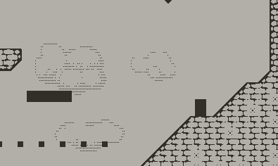

# Owlet's Embrace
The goal is to make a 2D metroidvania from scratch using almost no external libraries for the **Playdate** in C. I only upload the source code and keep stuff like lib files and assets local.

### Concept

It'll be a slower paced adventure platformer. While I also like fast paced "mashing the dash button" games I want to explore more deliberate movement. I love Zelda: Wind Waker, Link's Awakening, A Hat In Time, Celeste, 2D Metroid, Axiom Verge, Valheim. Most of these games have a certain "good vibes" feel to them, and a big focus on exploration, adventure, growing.

They rely on the usage of different tools/items and a blend of different moods/themes: On the one hand, there are relaxing places like a sleepy village, your hideout and the peaceful nature. Places to calm down and where you like to spend time in. On the other hand there are grim dungeons and dangerous places, filled with all kinds of unknown stuff, creatures and mysteries. I really like that back and forth. In the end most of the game will be designed as I go and based on what I like while iterating - bottom-up.

### Why Playdate
I've been on that game concept for a while now and wasn't able to make any notable progress mostly because of the unconstrained "blank page" problem: What resolution, should I go 2D/3D, what colors, how much performance, gamepad or keyboard, what graphics API, etc. I really tried to self-impose constraints like "make a game according to PICO-8 specs", but I can break those constraints just as easy as I created them so they're worth nothing to me.

I'm a stereotypical low-level-everything-from-scratch-C-programmer. I like retro gaming. Embedded platforms fascinate me. Enter the Playdate which combines everything into one. It puts hard constraints into place: Monochrome, fixed resolution, a small known CPU and limited Ram, a dpad, some buttons and a crank. And it's a modern handheld still in production, which makes a difference compared to an ancient device like the Game Boy.

### Misc

Rope mechanic running on the Playdate Simulator as of August 9th, 2023:

